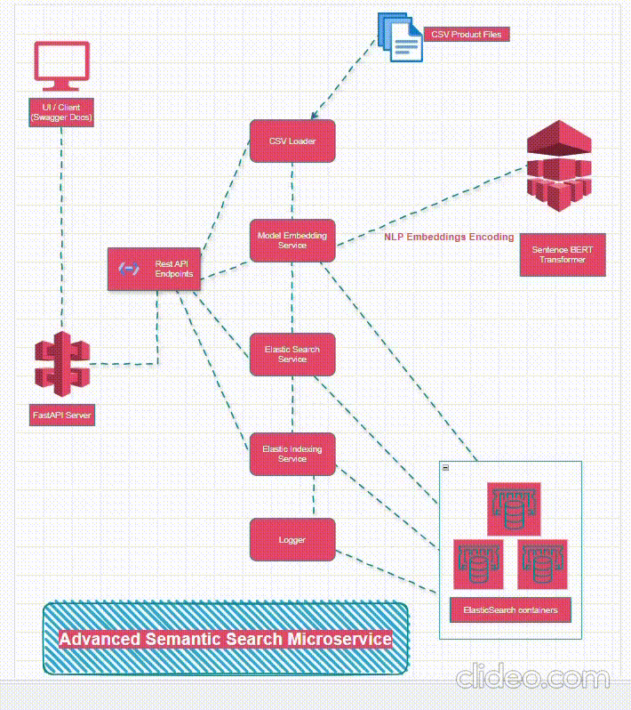

# Advanced Semantic Search with Elasticsearch

## Overview

This project implements an advanced semantic search engine for products using Elasticsearch, FastAPI and NLP Sentence Transformers. The application leverages sentence embeddings from BERT models to provide accurate and efficient semantic search capabilities. It includes endpoints for indexing products, retrieving all products with pagination, and searching for products by their descriptions and ids surfaced as RESTful APIs. The primary objective is to enable efficient and scalable semantic search over product descriptions by leveraging dense vector embeddings.

## Features

- **Semantic Search**: Uses Sentence BERT embeddings to derive meaning from product descriptions for semantic query matching.
- **Elasticsearch Integration**: Implements efficient indexing and search operations using Elasticsearch.
- **Scalable Architecture**: Designed to be highly available and scalable using Docker and Elasticsearch clusters.
- **Asynchronous Initialization**: Populates Elasticsearch with product data from a CSV file before the application starts.

## Table of Contents

- [Advanced Semantic Search with Elasticsearch](#advanced-semantic-search-with-elasticsearch)
  - [Overview](#overview)
  - [Features](#features)
  - [Table of Contents](#table-of-contents)
  - [Architecture](#architecture)
  - [Setup](#setup)
    - [Prerequisites](#prerequisites)
    - [Installation](#installation)
  - [Endpoints](#endpoints)
  - [Project Structure](#project-structure)

## Architecture


The project consists of the following components:

- **FastAPI Application**: Serves as the backend API providing read, get and search operations.
- **Elasticsearch**: Stores and indexes product data for fast and efficient search.
- **Sentence Transformers**: Used to encode product descriptions into dense vectors for semantic search.
- **Docker**: Manages containerized deployment of Elasticsearch and the FastAPI application. (elasticsearch run locally as a docker container)

## Setup

### Prerequisites

- [Docker](https://www.docker.com/)
- [Docker Compose](https://docs.docker.com/compose/)
- [Python 3.8+](https://www.python.org/)

### Installation

1. **Clone the Repository**:
   ```sh
   git clone https://github.com/yourusername/semantic-search-elasticsearch.git
   cd semantic-search-elasticsearch

2. **Create and Activate Virtual Environment**:

    ```sh
    python -m venv venv
    source venv/bin/activate   # On Windows use `venv\Scripts\activate`

3. **Install Dependencies**:

    ```sh
    pip install -r requirements.txt
4. **Set Up Environment Variables**:
    Update the .env file in the root directory as per your ES installation or use the one in project:

5. **Build and Run Docker Containers**:
    ```sh
    docker-compose up -d

6. **Run the Bootstrap Script**:
    ```sh
    python bootstrap.py

7. **Running the Application**:
    You can run the FastAPI Application:
    ```sh uvicorn app:app --reload

8. **Access the Application**:
    Open your browser and go to http://localhost:8000.

9. **Swagger Endpoints**:
    To try the endpoints, go to http://localhost:8000/docs
    

## Endpoints
- **GET /get_product/<product_id>**: Retrieve a product's information by ID.
- **GET /search_product**: Search for products based on a brief description.
- **GET /system_status**: Check if the system is up and running.
- **GET /get_all_products**: Retrieve all products from the Elasticsearch index with pagination support.

## Project Structure

    ├── semantic-search-elasticsearch/
    ├── app.py                 # Main application entry point
    ├── bootstrap.py           # Bootstrap script for initializing Elasticsearch
    ├── dependencies.py        # Dependency Injection
    ├── config/
    │   └── elastic_mapper.py  # Elasticsearch index mappings
    │   └── elastic_mapper.py  # Elasticsearch index mappings
    ├── model/
    │   └── product.py  # Elasticsearch index mappings
    ├── api/
    │   └── crud_endpoints.py  # API endpoints for app
    ├── services/
    │   ├── csv_loader.py      # CSV handling operations
    │   ├── elastic_service.py # Elastic Search data manipulations
    │   └── embedding_service.py # Loading model from env file
    │   └── elastic_search_index_service.py # Elasticsearch factory methods 
    │   └── elastic_mapper.py  # Elasticsearch index mappings
    │   └── check.py  # simple validation script
    ├── resources/
    │   └── myntra_products.csv # Sample product data
    ├── .env                   # Environment variables
    ├── .gitignore             # Git ignore file
    ├── README.md              # Project readme file
    └── requirements.txt       # Python dependencies


